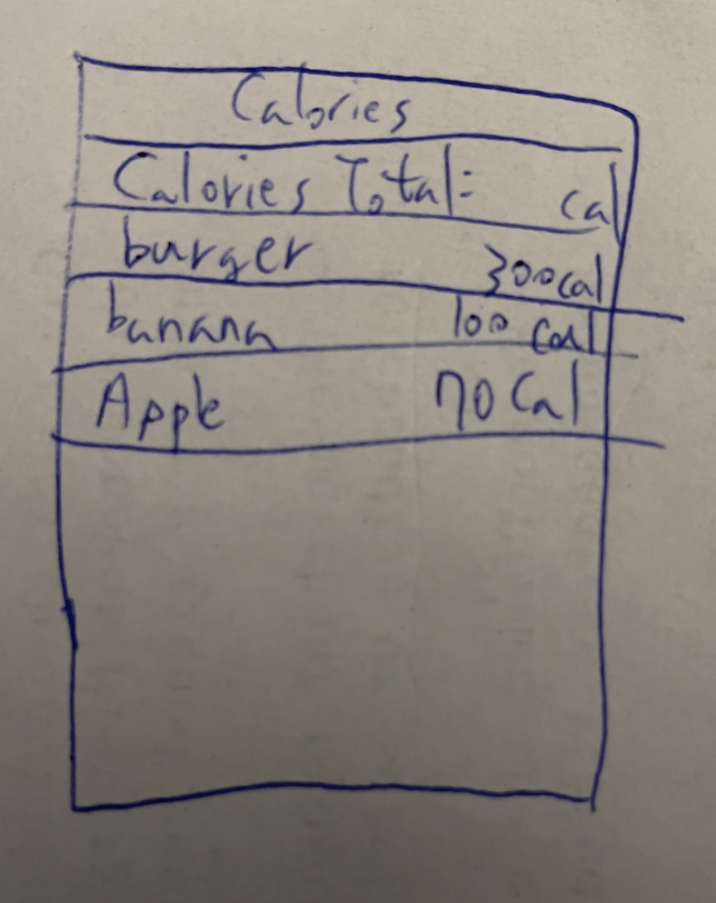
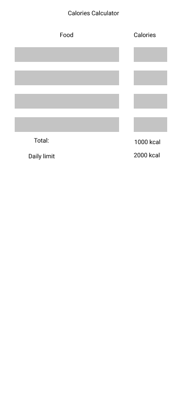

Group project

Unit 8: Group Milestone - README Example
===

:::info
**Below is an example** of what your **Group Project README** should include and how it should be structured for the **Unit 8 Group Milestone Submission**.
:::

# Calorie Counter
App countes calories based on the user input

## Table of Contents
1. [Overview](#Overview)
1. [Product Spec](#Product-Spec)
1. [Wireframes](#Wireframes)

## Overview
### Description
Tracks how much calory user intakes in a day

### App Evaluation
- **Category:** Food / Health
- **Mobile:** This app would be primarily developed for mobile 
- **Story:** User inputs foods and the app counts the calories of the input
- **Market:** Anyone
- **Habit:** This app could be used as often or unoften as the user wanted
- **Scope:** Simple calorie counting app based on the user input

## Product Spec
### 1. User Stories (Required and Optional)

**Required Must-have Stories**

* User enters the calory of the food they're about consume
* User writes the food entry to add up to the total calory
* The app shows the list of foods the user entered and total calories

**Optional Nice-to-have Stories**

* User enters their daily maximum calory amount
* Weekly history of days of calories
* A separate page to list most consumed
* Settings (Accesibility, Notification, General, etc.)
* User profile - login/logout, data persistence
* NLP - app recognizes food names and automatically suggests the calories

### 2. Screen Archetypes

* Empty list for adding entries of food name and calories 
* Total calories that add up in the bottom or top

Optional:

* Daily Maximum calory amount input 
* A list of most consumed foods
* Profile screen - login / logout 
* Settings Screen
   * Lets people change language, and app notification settings.

### 3. Navigation

**Tab Navigation** (Tab to Screen)

* List of food + total calories

Optional:
* Share daily consumption with others
* Meal suggestion
* Weekly History
* Settings
* Login / Logout
* Profile

**Flow Navigation** (Screen to Screen)
* Login / Logout
* Profile -> Goal field to be modified. 
* Settings -> Toggle settings

## Wireframes
 
 

## Schema
Models
* Food String dictionary associated with int for calories
* total calories int
* daily calories limit int

Networking
* Not necessary for required

